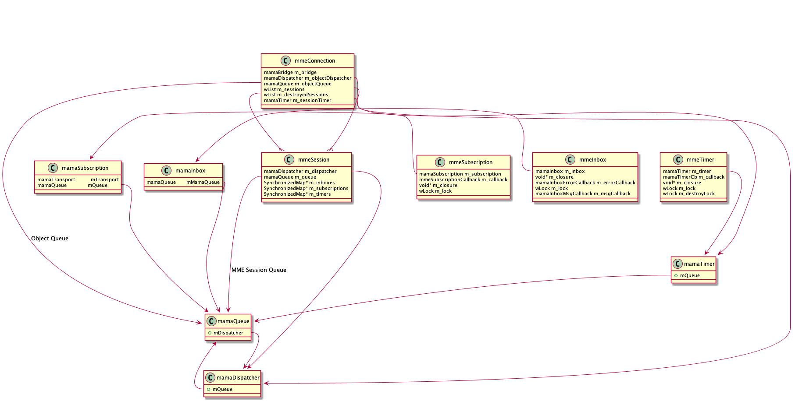

# MAMA Managed Environment (MME)
The MME (MAMA Managed Environment) library is designed to address several deficiences of MAMA for dynamic multi-threaded programs:

- Event objects (subscriptions, inboxes and timers) can be destroyed from any thread, not just the thread that is dispatching the objects' queue.
- Shutdown is handled automatically by the library, such that:
  - Dispatchers, events, queues, and transports are automically shut down in the correct order.
  - The shutdown process is thread-safe (i.e., there are no data races).
  - Event objects cannot leak -- any existing event objects are automatically destroyed when their parent session is destroyed.


## Design
MME defines two new abstractions that are used to manage the native MAMA objects.

### Connection
A connection (`mamaEnvConnection`) represents a specific instance of a MAMA transport.  Internally it encapsulates a `mamaBridge`.

In addition, the connection creates two collections:

- `m_sessions` is a list of session objects created from the connection;
- `m_destroyedSessions` is a list of session objects that have been marked for deletion. 
  - A session is marked for deletion by moving it from the `m_sessions` list to the `m_destroyedSessions` list.

The connection object also creates a queue/dispatcher pair, along with a timer associated with the queue/dispatcher:

- Every `MEVC_SESSION_TIMER_INTERVAL` (default 1) seconds, `mamaEnvConnection_onSessionTimerTick` calls `mamaEnvConnection_onSessionDestroyListEnumerate`, which attempts to completely destroy any sessions that have been marked for deletion.    

- When `mamaEnv_createSession` is called, an event is enqueued to actually create the session.

  > Why?  Why can't the session be created immediately?

- When `mamaEnv_destroyConnection` is called, an event is enqueued to destroy all the connections' session objects.

### Session
A session (`mamaEnvSession`) essentially represents a callback thread that is associated with a specific connection.  Internally it encapsulates a `mamaQueue`/`mamaDispatcher` pair. 

The session object also keeps track of all the event objects associated with the session.  When a session is destroyed (either by calling `mamaEnv_destroySession` directly, or by calling `mamaEnv_destroyConnection`, which calls `mamaEnv_destroySession` for each of its child sessions), it first destroys all its associated event objects.

### "Wrapper" objects
In addition to the connection and session objects defined above, MME defines its own abstractions that "wrap" native MAMA objects -- i.e., `mamaEnvTimer` which wraps native `mamaTimer`.  These wrapper objects provide synchronization for the underlying MAMA objects.

The relationships among the various objects can be see here:



#### Tricky Bit
The original design uses a clever trick to make MME event objects interchangeable with the native MAMA objects which they manage.  The MME objects are defined as `struct`s where the first member is the native MAMA object.   

The C standard (§ 6.7.2.1) mandates that the address of a struct, and the address of its first member, be interchangeable, so e.g. a `mmeTimer` can be used anywhere a `mamaTimer` can be. 

> A pointer to a structure object, suitably converted, points to its initial member, and vice versa. 

So, for example `mamaEnv_createTimer` returns a `mamaTimer` (by address), but the address is in fact the address of the internal `mmeTimer` struct.

### Event destruction
Destroying event sources and sinks is a particularly tricky problem, especially in multi-threaded programs.  MME makes this problem a bit more tractable by destroying event objects in two stages:

1. The API call (`mamaEnv_destroyXXX`) to destroy the event clears the object's callback pointers (under control of a mutex), and enqueues an event on the session queue to complete the object destruction.  

2. When the destroy event is dispatched it completes the object destruction by destroying the underlying MAMA and transport bridge objects, and freeing its own memory (under control of the object mutex).

Here it is in more detail:

1. Application calls `mamaEnv_destroyXXX`
   1. The event object is removed from the session's collection
   2. Call `mamaEnvSession_destroyXXX`
      1. Acquire object mutex
      2. Clear callback pointers
      3. Release mutex
      4. Enqueue an event (on session queue) to call `mamaEnvXXX_onXXXDestroy`

When the `mamaEnvXXX_onXXXDestroy` event is dispatched:
  
1. Acquire object mutex
2. Call `mamaEnvXXX_destroy`
   1. Call `mamaXXX_destroy` to destroy the underlying MAMA object
      1. Call `bridgeMamaXXX_destroy` to destroy the underlying transport bridge object.
3. Release object mutex
4. Free object memory


### Event shutdown
MME adds an important feature that is completely lacking in MAMA, which is the ability to coordinate the shutdown of an event object with a callback function that may be running in a different thread.

When a call to `mamaEnv_shutdownXXX` returns, the caller is guaranteed that:

1. There are no callback functions running against the object in any thread.

~~2. No subsequent callback functions will be invoked against the object.~~

> For this to be true, the callback pointers in the underlying MAMA object need to be cleared, but there is no way to do that in MAMA without calling mamaXXX_destroy.
> Maybe mamaXXX_destroy can be called in step 1?  (We have the mutex so can guarantee that no callback is running).


## Example code
To create a connection, first initilize MAMA and then create a `mamaEnvConnection ` object:

```
mamaBridge bridge;
mama_loadBridge(&bridge, ...);
mama_open();
mamaTransport transport;
mamaTransport_create(..., bridge);

mamaEnvConnection connection;
mamaEnv_createConnection(bridge, &connection);
```

Once you've done that, you can create a session, and then use it to create managed event objects:

```
mamaEnvSession session;
mamaEnv_createSession(connection, &session);

mamaTimer timer;
mamaEnv_createTimer(... session, &timer);
```

Note that in the example above, we define the result of the `mamaEnv_createTimer` call as a `mamaTimer `.  In actuality, `mamaEnv_createTimer` creates a struct (`mamaEnvTimer`) in which the `mamaTimer` is the first member.  (See [Tricky Bit](#Tricky-Bit), below).

To stop events from firing, call the appropriate `mamaEnv_shutdown...` function:

```
mamaEnv_shutdownTimer(session, timer);
```

This leaves the object allocated, but "inactive" -- no further callbacks will be invoked on the object.

To completely destroy the object, call the appropriate `mamaEnv_destroy...` function:

```
mamaEnv_destroyTimer(session, timer);
```

This deallocates all the memory associated with the object. 

> Note that the destruction is NOT done immediately -- the destroy is queued on the session's event queue.  

When the application is ready to terminate, it should first shutdown and then destroy the session and connection objects:

```
mamaEnv_shutdownSession(connection, session);
mamaEnv_destroySession(connection, session);
```

This call will destroy all sessions, and their associated event objects:

```
mamaEnv_destroyConnection(connection);
```


## History
MME was originally developed by Graeme Clarke of NYSE Technologies, back when NYFIX was also part of NYSE.  It was eventually supposed to become part of MAMA proper, but that never happened, and when NYSE divested NYFIX and NYSE Technologies, MME was transferred back to NYFIX.

MME has been used in the NYFIX Marketplace since 2010, processing up to 50 million messages per day.
